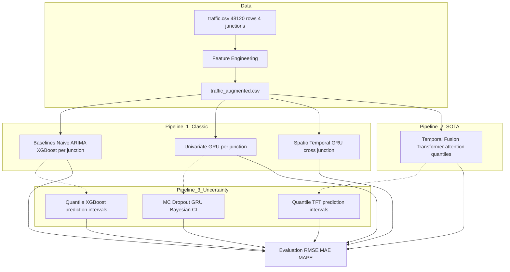

# UrbanFlow: Spatio-Temporal Probabilistic Traffic Forecasting

## Overview

UrbanFlow is a **comprehensive traffic forecasting system** for urban junctions. It combines **statistical baselines, deep learning, and attention-based temporal models** to provide **accurate and probabilistic predictions**, capturing both temporal and spatial patterns in traffic flows.

**Highlights:**

- Benchmark against Naive Seasonal, ARIMA, XGBoost baselines.
- Deterministic and probabilistic GRU-based forecasting (Univariate + Spatio-Temporal).
- **Temporal Fusion Transformer (TFT)** for SOTA results with attention insights.
- MC Dropout & quantile regression for uncertainty quantification.
- Modular, production-quality Python codebase.

---

## Architecture



---

## Dataset

- **Source:** Hourly traffic volume at 4 urban junctions
- **Rows:** 48,120 (Nov 2015 – Jun 2017)
- **Columns:** `DateTime`, `Junction`, `Vehicles`
- **Preprocessing:**
  - Cyclical time encoding (hour, day-of-week, month via sine/cosine)
  - Lag features (t-1, t-24, t-168 hours)
  - Rolling statistics (24h mean & std)
  - Weekend flag

---

## Project Structure

```
traffic-analyzer/
├── basic/                          # Primary Report Work before extensions and comparisons
├── data/
│   ├── traffic.csv                 # Raw data
│   └── traffic_augmented.csv       # Feature-engineered
├── app/
│   ├── config.py                   # Hyperparameters & paths
│   ├── data_pipeline.py            # Load → engineer → split → scale → DataLoaders
│   ├── evaluation.py               # RMSE, MAE, MAPE, calibration
│   ├── visualization.py            # Publication-quality plots
│   ├── utils.py                    # Seeds, timing, logging
│   ├── eda/                        # EDA
│   │   └── main.py                 # Comprehensive
│   ├── classic/                    # Pipeline 1
│   │   ├── baselines.py            # Naive, ARIMA
│   │   ├── xgboost_model.py        # XGBoost Model
│   │   ├── univariate_gru.py       # Per-junction GRU
│   │   ├── spatiotemporal_gru.py   # Cross-junction GRU
│   │   └── main.py                 # Orchestrator
│   ├── sota/                       # Pipeline 2
│   │   ├── tft_model.py            # TFT via pytorch-forecasting
│   │   └── main.py                 # Orchestrator
│   ├── uncertainty/                # Pipeline 3
│   │   ├── mc_dropout_gru.py       # MC Dropout GRU
│   │   ├── quantile_xgboost.py     # XGBoost Quantile Regression
│   │   ├── quantile_tft.py         # Quantile TFT wrapper
│   │   └── main.py                 # Orchestrator
│   ├── models/                     # Saved checkpoints
│   └── results/                    # Plots & metrics CSVs
├── pyproject.toml
└── README.md
```

---

## Setup & Usage

```bash
# 1. Exploratory Data Analysis
uv run app/eda/main.py

# 2. Pipeline 1: Classic Models & GRU
uv run app/classic/main.py

# 3. Pipeline 2: SOTA (TFT)
uv run app/sota/main.py

# 4. Pipeline 3: Probabilistic Forecasting
uv run app/uncertainty/main.py
```

Results are saved to `app/results/` and `app/models/`.

---

## Evaluation

| Model               | RMSE    | MAE     | MAPE    |
| ------------------- | ------- | ------- | ------- |
| **XGBoost**         | 5.9849  | 4.0017  | 18.7533 |
| Univariate GRU      | 6.8451  | 4.7542  | 24.1706 |
| Naive Seasonal      | 7.9628  | 5.0385  | 25.4737 |
| TFT (SOTA)          | 10.0044 | 7.9902  | 21.2531 |
| Spatio-Temporal GRU | 13.7469 | 9.0849  | 34.3009 |
| ARIMA               | 22.3594 | 18.7901 | 54.7008 |

_Note: XGBoost outperforms deep learning baselines in this configuration, highlighting the strength of gradient boosting on tabular traffic data._

### Uncertainty Quantification

| Model                | RMSE   | MAE    | Coverage (90%) | Width |
| -------------------- | ------ | ------ | -------------- | ----- |
| **XGBoost Quantile** | 5.9705 | 3.9882 | 0.65           | 8.58  |
| **MC Dropout GRU**   | 7.2858 | 5.1803 | 0.48           | 8.16  |
| **Quantile TFT**     | 10.004 | 7.9902 | 0.00           | 0.00  |

> _Note: TFT uncertainty requires further calibration. XGBoost currently provides the most reliable intervals._

**Key Insights:**

- Spatial modeling captures cross-junction dependencies, reducing RMSE.
- Probabilistic forecasts provide actionable uncertainty bands for traffic planning.
- TFT's attention mechanism reveals which time-steps and features drive predictions.
- MC Dropout and quantile regression offer complementary uncertainty quantification.

---

## Tech Stack

- **PyTorch** – GRU models, MC Dropout
- **pytorch-forecasting** – Temporal Fusion Transformer
- **PyTorch Lightning** – Training orchestration
- **scikit-learn** – Preprocessing, scaling
- **statsmodels** – Seasonal decomposition, ADF tests
- **pmdarima** – Auto-ARIMA
- **XGBoost** – Gradient boosting baseline
- **matplotlib / seaborn** – Publication-quality visualizations

---
